# Form Import & OCR Detection - Setup Guide

This document describes the Form Import & OCR Detection feature implementation and setup instructions.

## Overview

The feature enables automatic field detection from uploaded form images (cheques, government forms, shipping labels) using Azure Document Intelligence OCR, with manual review and element creation workflow.

### Workflow Diagram

[Cheque Upload + Auto-Detection Workflow (FigJam)](https://www.figma.com/online-whiteboard/create-diagram/91daa04e-99a8-4a98-9c9f-7c2af8db734e?utm_source=other&utm_content=edit_in_figjam&oai_id=&request_id=4af0e464-3392-4bff-b3b3-41d5fb0ed6ed)

```mermaid
flowchart LR
    A["Designer uploads cheque image"] --> B["System stores image as page background"]
    B --> C["OCR: Azure Document Intelligence"]
    C --> D["Extract words + bounding boxes"]
    D --> E["Field classifier suggests element types"]
    E --> F["Detection overlays appear on canvas"]
    F --> G["User reviews: accept/reject/edit type"]
    G --> H["Accepted detections become FormCraft elements"]
    H --> I["Save template"]
    I --> J["Template ready for fill mode & PDF export"]
```



## Implementation Status

### ✅ Completed

**Specifications:**
- Added User Story 8 to `specs/04-design-studio/spec.md`
- Added 26 tasks (T04-110 through T04-135) in `specs/04-design-studio/tasks.md`
- Extended `specs/06-pdf-engine/spec.md` with filled data rendering

**Database:**
- Created migration `migrations/008_form_detections.sql` for `form_detections` table

**Backend Modules Created (in `FormCraft/formcraft-backend/`):**
- `app/services/ocr/__init__.py` - OCR services package
- `app/services/ocr/azure_ocr.py` - Azure Document Intelligence client
- `app/services/ocr/field_classifier.py` - AI-powered field type suggester
- `app/services/ocr/bounding_box_converter.py` - Pixel to mm coordinate converter
- `app/models/form_detection.py` - Pydantic models for detections
- `app/api/routes/forms.py` - API endpoints for form import and OCR
- Updated `app/core/config.py` with Azure credentials

### 🔲 Pending (To be done in actual backend repo)

1. **Copy files to actual backend repository** (`/media/yasser/Work/Projects/formcraft-backend/`)
2. **Register forms router** in main FastAPI app
3. **Update requirements.txt** with dependencies
4. **Update .env.example** with Azure credentials
5. **Apply database migration** via Supabase MCP
6. **Test OCR integration** with sample cheques

## Setup Instructions

### 1. Copy Backend Files

Copy the created files from `FormCraft/formcraft-backend/` to the actual backend repo:

```bash
cd /media/yasser/Work/Projects/FormCraft/formcraft-backend/app
cp -r services/ocr /media/yasser/Work/Projects/formcraft-backend/app/services/
cp -r models/form_detection.py /media/yasser/Work/Projects/formcraft-backend/app/models/
cp -r api/routes/forms.py /media/yasser/Work/Projects/formcraft-backend/app/api/routes/
cp core/config.py /media/yasser/Work/Projects/formcraft-backend/app/core/
```

### 2. Register Forms Router

In `/media/yasser/Work/Projects/formcraft-backend/app/main.py`, add:

```python
from app.api.routes import forms

# ... existing routers ...
app.include_router(forms.router, prefix="/api")
```

### 3. Add Dependencies

Add to `/media/yasser/Work/Projects/formcraft-backend/requirements.txt`:

```
azure-ai-formrecognizer==3.3.0
Pillow==10.2.0
```

Install:
```bash
cd /media/yasser/Work/Projects/formcraft-backend
source venv/bin/activate
pip install azure-ai-formrecognizer==3.3.0 Pillow==10.2.0
```

### 4. Configure Azure Credentials

Add to `/media/yasser/Work/Projects/formcraft-backend/.env`:

```bash
# Azure Document Intelligence
AZURE_DOCUMENT_INTELLIGENCE_ENDPOINT=https://YOUR_RESOURCE.cognitiveservices.azure.com/
AZURE_DOCUMENT_INTELLIGENCE_KEY=your_api_key_here
```

**To get Azure credentials:**
1. Go to [Azure Portal](https://portal.azure.com)
2. Create "Document Intelligence" resource (free tier available)
3. Copy Endpoint and Key from resource overview

### 5. Apply Database Migration

Using Supabase MCP or SQL editor:

```sql
-- Run the migration from migrations/008_form_detections.sql
```

Or via MCP:
```typescript
await mcp2_apply_migration({
  project_id: "thwjbagnrcasioiymlsi",
  name: "008_form_detections",
  query: "-- content of 008_form_detections.sql --"
});
```

### 6. Test OCR Integration

```bash
# Restart backend
cd /media/yasser/Work/Projects/formcraft-backend
pkill -f uvicorn
source venv/bin/activate
uvicorn app.main:app --port 8000 --reload

# Test with sample cheque
curl -X POST http://localhost:8000/api/forms/import/{template_id} \
  -H "Authorization: Bearer YOUR_JWT" \
  -F "file=@/media/yasser/Work/Projects/FormCraft/Samples/BanqueMisr_EG.jpg" \
  -F "page_index=0"
```

Expected response:
```json
{
  "id": "...",
  "template_id": "...",
  "page_index": 0,
  "detected_fields": [
    {
      "text": "25-09-2012",
      "bbox": {"x": 10.5, "y": 20.3, "width": 30.2, "height": 8.1},
      "confidence": 0.95,
      "suggested_type": "date",
      "status": "pending"
    },
    // ... more fields
  ],
  "page_dimensions": {"width": 210.0, "height": 148.5},
  "created_at": "2026-02-28T19:30:00Z"
}
```

## API Endpoints

| Method | Endpoint | Description |
|--------|----------|-------------|
| POST | `/api/forms/import/{template_id}` | Upload form image and run OCR |
| GET | `/api/forms/{template_id}/detections` | Get all detections for template |
| POST | `/api/forms/{template_id}/detections/{detection_id}/accept` | Accept detections and create elements |
| DELETE | `/api/forms/detections/{detection_id}` | Delete detection record |

## Architecture

```
User uploads form image
  ↓
Backend receives file
  ↓
AzureOCRClient.analyze_layout()
  → Extracts words with bounding boxes
  ↓
BoundingBoxConverter
  → Converts pixel coords to mm
  ↓
FieldClassifier
  → Suggests element types (date, currency, text, etc.)
  ↓
Store in form_detections table
  ↓
Return detections to frontend
  ↓
User reviews in detection overlay
  ↓
Accept → Create FormCraft elements
```

## Field Classification Logic

**Date fields:** Detected by patterns (`DD/MM/YYYY`) or nearby labels ("تاريخ", "Date")  
**Currency fields:** Detected by symbols ("EGP", "ر.س") or nearby labels ("مبلغ", "Amount")  
**Signature fields:** Empty regions near "توقيع" or "Signature" labels  
**Checkbox fields:** Small square regions (5-15mm), aspect ratio 0.8-1.2  
**Number fields:** Numeric-only content  
**Text fields:** Default for all others

## Cost & Performance

**Azure Free Tier:**
- 500 pages/month free
- After: $1.50 per 1,000 pages

**Expected Performance:**
- OCR latency: 2-5 seconds per page
- Detection accuracy: 90%+ on sample cheques (to be validated)
- Field classification: 85%+ accuracy target

## Troubleshooting

**"AZURE_DOCUMENT_INTELLIGENCE_ENDPOINT not configured"**
→ Add Azure credentials to `.env` file

**"Transport error" or MCP connection issues**
→ Restart Windsurf IDE or use direct SQL for migration

**OCR returns no detections**
→ Check image quality, ensure JPEG/PNG format, verify Azure API quota

**Low classification accuracy**
→ Adjust patterns in `field_classifier.py`, add more indicators for Arabic forms

## Next Steps (Frontend - P2)

1. Create import dialog component (Angular)
2. Implement detection overlay on canvas
3. Build accept/reject UI for each detection
4. Add "Accept All" / "Reject All" buttons
5. Implement fill mode for data entry
6. Add validation and live preview

See `specs/04-design-studio/tasks.md` Phase 12 for detailed task breakdown.
